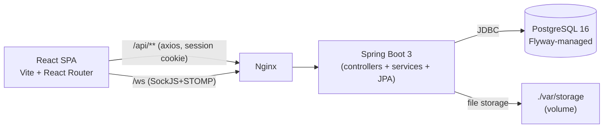

# Документация проекта **Бёreza**

Мессенджер для путников, путевождей и гостинных дворов — Spring Boot 3 (Java 21) + React 18 (Vite) + PostgreSQL 16.

## Состав каталога

| Файл | Что внутри |
|---|---|
| [`api-endpoints.md`](./api-endpoints.md) | Полная справка по REST API (`/api/**`): метод, путь, доступ, параметры, тело запроса/ответа, коды ошибок. |
| [`websocket-endpoints.md`](./websocket-endpoints.md) | STOMP-эндпоинты (`/app/**`) и топики, на которые подписывается клиент. |
| [`web-pages.md`](./web-pages.md) | Страницы SPA-фронтенда: маршруты React Router, требуемая роль, какие REST/WS-эндпоинты задействует. |
| [`uml-class.md`](./uml-class.md) | UML class diagram (Mermaid) доменной модели. |
| [`er-diagram.md`](./er-diagram.md) | ER-диаграмма схемы PostgreSQL (Mermaid). |
| [`use-case.md`](./use-case.md) | Use-case диаграмма для четырёх ролей: путник, путевождь, гостинный двор, воевода. |
| [`user-story-map.md`](./user-story-map.md) | User Story Map — действия пользователей по «магистралям» (backbone) и релизным срезам. |

## Архитектура одной картинкой

## Где смотреть диаграммы

Все диаграммы написаны в **Mermaid** и рендерятся прямо на GitHub/GitLab/в большинстве IDE.
Для офлайн-просмотра можно воспользоваться [mermaid.live](https://mermaid.live).
