# ER-диаграмма базы данных

PostgreSQL 16, миграции через Flyway:
- `V1__init_schema.sql` — основная схема.
- `V2__spring_session.sql` — таблицы Spring Session JDBC.
- `V3__seed_demo_data.sql` — демо-пользователи и три отеля.

```mermaid
erDiagram
  USERS ||--o{ HOTELS : "owns"
  USERS ||--o{ BOOKINGS : "guest"
  USERS ||--o{ CHATS : "owns"
  USERS ||--o{ CHAT_MEMBERS : "joins"
  USERS ||--o{ MESSAGES : "sends"
  USERS ||--o{ ATTACHMENTS : "uploads"
  USERS ||--o{ MESSAGE_READS : "reads"
  USERS ||--o{ GEO_POINTS : "author"
  USERS ||--o{ NOTIFICATIONS : "receives"

  HOTELS ||--o{ BOOKINGS : "for"

  CHATS ||--o{ CHAT_MEMBERS : "has"
  CHATS ||--o{ MESSAGES : "contains"
  CHATS ||--o{ GEO_POINTS : "scoped"
  CHATS ||--o| BOOKINGS : "discussion"

  MESSAGES ||--o{ ATTACHMENTS : "attaches"
  MESSAGES ||--o{ MESSAGE_READS : "read receipts"
  MESSAGES ||--o{ MESSAGES : "reply_to"

  USERS {
    bigint id PK
    varchar(50) username "UQ on lower()"
    varchar(254) email "UQ on lower()"
    varchar(255) password_hash
    varchar(100) display_name
    varchar(16) role "CHECK in TOURIST/GUIDE/HOTEL/ADMIN"
    varchar(32) phone
    varchar(512) avatar_url
    boolean is_enabled
    boolean is_locked
    timestamptz last_seen_at
    timestamptz created_at
    timestamptz updated_at
  }

  HOTELS {
    bigint id PK
    bigint owner_id FK "→ users (ON DELETE SET NULL)"
    varchar(200) name
    text description
    varchar(120) city
    varchar(500) address
    float8 latitude
    float8 longitude
    smallint stars "CHECK 1..5"
    numeric_12_2 price_per_night
    varchar(3) currency
    int rooms_available
    text_arr photos
    text_arr amenities
    boolean is_active
    timestamptz created_at
    timestamptz updated_at
  }

  BOOKINGS {
    bigint id PK
    bigint hotel_id FK "→ hotels (RESTRICT)"
    bigint user_id FK "→ users (RESTRICT)"
    date check_in
    date check_out "CHECK check_out > check_in"
    smallint guests
    smallint rooms
    numeric_12_2 total_price
    varchar(3) currency
    varchar(16) status "PENDING/CONFIRMED/CANCELLED/COMPLETED"
    bigint chat_id FK "→ chats (SET NULL)"
    timestamptz created_at
    timestamptz updated_at
  }

  CHATS {
    bigint id PK
    varchar(16) type "PERSONAL/GROUP"
    varchar(120) title
    varchar(500) description
    varchar(512) avatar_url
    bigint owner_id FK "→ users (SET NULL)"
    timestamptz created_at
    timestamptz updated_at
  }

  CHAT_MEMBERS {
    bigint chat_id PK_FK
    bigint user_id PK_FK
    varchar(16) member_role "OWNER/ADMIN/MEMBER"
    timestamptz joined_at
    bigint last_read_message_id
    boolean muted
  }

  MESSAGES {
    bigint id PK
    bigint chat_id FK "→ chats (CASCADE)"
    bigint sender_id FK "→ users (SET NULL)"
    varchar(16) type "TEXT/FILE/GEO/SYSTEM/BOOKING"
    text content
    jsonb payload
    bigint reply_to_id FK "→ messages (SET NULL)"
    timestamptz edited_at
    timestamptz deleted_at
    timestamptz created_at
  }

  MESSAGE_READS {
    bigint message_id PK_FK
    bigint user_id PK_FK
    timestamptz read_at
  }

  ATTACHMENTS {
    bigint id PK
    bigint message_id FK "→ messages (CASCADE), null = висящий"
    bigint uploader_id FK "→ users (RESTRICT)"
    varchar(512) storage_key
    varchar(255) original_name
    varchar(120) mime_type
    bigint size_bytes
    varchar(64) checksum_sha256
    varchar(32) category "GENERIC/IMAGE/PDF/INSURANCE/VOUCHER/TICKET"
    timestamptz created_at
  }

  GEO_POINTS {
    bigint id PK
    bigint chat_id FK "→ chats (CASCADE)"
    bigint author_id FK "→ users (CASCADE)"
    varchar(20) type "USER_LOCATION/MEETING_POINT/ATTRACTION/EMERGENCY"
    varchar(150) title
    varchar(500) description
    float8 latitude
    float8 longitude
    timestamptz expires_at
    timestamptz created_at
  }

  NOTIFICATIONS {
    bigint id PK
    bigint user_id FK "→ users (CASCADE)"
    varchar(32) type "NEW_MESSAGE/BOOKING_NEW/BOOKING_STATUS/..."
    varchar(200) title
    varchar(2000) body
    jsonb payload
    boolean is_read
    timestamptz created_at
  }
```

## Индексы

| Таблица | Индексы (помимо PK) |
|---|---|
| `users` | `UNIQUE (lower(username))`, `UNIQUE (lower(email))`, `(role)` |
| `chats` | `(type)`, `(owner_id)` |
| `chat_members` | `(user_id)` |
| `messages` | `(chat_id, created_at DESC)`, `(sender_id)` |
| `message_reads` | `(user_id)` |
| `attachments` | `(message_id)`, `(uploader_id)` |
| `hotels` | `(city)`, `(owner_id)`, `(price_per_night)`, `(is_active)` |
| `bookings` | `(user_id)`, `(hotel_id)`, `(status)`, `(check_in)` |
| `geo_points` | `(chat_id)`, `(author_id)`, `(type)` |
| `notifications` | `(user_id, is_read, created_at DESC)` |

## Каскады

- `users` → `hotels.owner_id`: **SET NULL** (отель остаётся, владелец «потерян»).
- `users` → `chats.owner_id`, `messages.sender_id`: **SET NULL** — историю сохраняем.
- `users` → `chat_members`, `message_reads`, `notifications`, `geo_points.author_id`, `attachments.uploader_id`: **CASCADE** / **RESTRICT** (attachments — нельзя удалить пользователя, пока висят его файлы).
- `chats` → дочерние (`messages`, `chat_members`, `geo_points`): **CASCADE**.
- `messages` → `attachments`, `message_reads`: **CASCADE**.
- `hotels` → `bookings`: **RESTRICT** — нельзя удалить отель, по которому есть брони.
