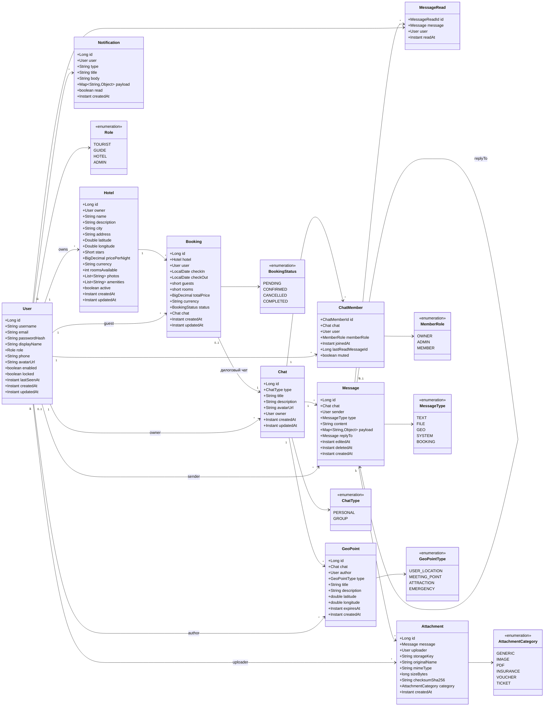
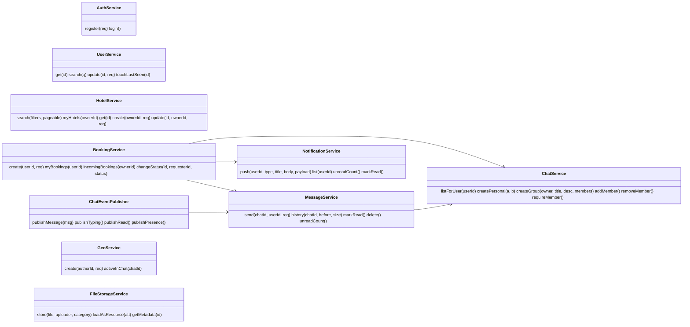

# UML — диаграмма классов (доменная модель)

```mermaid
classDiagram
  direction LR

  class User {
    +Long id
    +String username
    +String email
    +String passwordHash
    +String displayName
    +Role role
    +String phone
    +String avatarUrl
    +boolean enabled
    +boolean locked
    +Instant lastSeenAt
    +Instant createdAt
    +Instant updatedAt
  }

  class Hotel {
    +Long id
    +User owner
    +String name
    +String description
    +String city
    +String address
    +Double latitude
    +Double longitude
    +Short stars
    +BigDecimal pricePerNight
    +String currency
    +int roomsAvailable
    +List~String~ photos
    +List~String~ amenities
    +boolean active
    +Instant createdAt
    +Instant updatedAt
  }

  class Booking {
    +Long id
    +Hotel hotel
    +User user
    +LocalDate checkIn
    +LocalDate checkOut
    +short guests
    +short rooms
    +BigDecimal totalPrice
    +String currency
    +BookingStatus status
    +Chat chat
    +Instant createdAt
    +Instant updatedAt
  }

  class Chat {
    +Long id
    +ChatType type
    +String title
    +String description
    +String avatarUrl
    +User owner
    +Instant createdAt
    +Instant updatedAt
  }

  class ChatMember {
    +ChatMemberId id
    +Chat chat
    +User user
    +MemberRole memberRole
    +Instant joinedAt
    +Long lastReadMessageId
    +boolean muted
  }

  class Message {
    +Long id
    +Chat chat
    +User sender
    +MessageType type
    +String content
    +Map~String,Object~ payload
    +Message replyTo
    +Instant editedAt
    +Instant deletedAt
    +Instant createdAt
  }

  class MessageRead {
    +MessageReadId id
    +Message message
    +User user
    +Instant readAt
  }

  class Attachment {
    +Long id
    +Message message
    +User uploader
    +String storageKey
    +String originalName
    +String mimeType
    +long sizeBytes
    +String checksumSha256
    +AttachmentCategory category
    +Instant createdAt
  }

  class GeoPoint {
    +Long id
    +Chat chat
    +User author
    +GeoPointType type
    +String title
    +String description
    +double latitude
    +double longitude
    +Instant expiresAt
    +Instant createdAt
  }

  class Notification {
    +Long id
    +User user
    +String type
    +String title
    +String body
    +Map~String,Object~ payload
    +boolean read
    +Instant createdAt
  }

  class Role {
    <<enumeration>>
    TOURIST
    GUIDE
    HOTEL
    ADMIN
  }
  class ChatType {
    <<enumeration>>
    PERSONAL
    GROUP
  }
  class MemberRole {
    <<enumeration>>
    OWNER
    ADMIN
    MEMBER
  }
  class MessageType {
    <<enumeration>>
    TEXT
    FILE
    GEO
    SYSTEM
    BOOKING
  }
  class BookingStatus {
    <<enumeration>>
    PENDING
    CONFIRMED
    CANCELLED
    COMPLETED
  }
  class GeoPointType {
    <<enumeration>>
    USER_LOCATION
    MEETING_POINT
    ATTRACTION
    EMERGENCY
  }
  class AttachmentCategory {
    <<enumeration>>
    GENERIC
    IMAGE
    PDF
    INSURANCE
    VOUCHER
    TICKET
  }

  User "1" --> "*" Hotel : owns
  Hotel "1" --> "*" Booking
  User "1" --> "*" Booking : guest
  Booking "0..1" --> "1" Chat : дилоговый чат
  User "1" --> "*" Chat : owner
  Chat "1" --> "*" ChatMember
  User "1" --> "*" ChatMember
  Chat "1" --> "*" Message
  User "0..1" --> "*" Message : sender
  Message "0..1" --> "*" Message : replyTo
  Message "1" --> "*" Attachment
  User "1" --> "*" Attachment : uploader
  Message "1" --> "*" MessageRead
  User "1" --> "*" MessageRead
  Chat "1" --> "*" GeoPoint
  User "1" --> "*" GeoPoint : author
  User "1" --> "*" Notification
  User --> Role
  Chat --> ChatType
  ChatMember --> MemberRole
  Message --> MessageType
  Booking --> BookingStatus
  GeoPoint --> GeoPointType
  Attachment --> AttachmentCategory
```

## Сервисный слой (упрощённо)

```mermaid
classDiagram
  direction LR
  class AuthService { register(req) login() }
  class UserService { get(id) search(q) update(id, req) touchLastSeen(id) }
  class HotelService { search(filters, pageable) myHotels(ownerId) get(id) create(ownerId, req) update(id, ownerId, req) }
  class BookingService { create(userId, req) myBookings(userId) incomingBookings(ownerId) changeStatus(id, requesterId, status) }
  class ChatService { listForUser(userId) createPersonal(a, b) createGroup(owner, title, desc, members) addMember() removeMember() requireMember() }
  class MessageService { send(chatId, userId, req) history(chatId, before, size) markRead() delete() unreadCount() }
  class ChatEventPublisher { publishMessage(msg) publishTyping() publishRead() publishPresence() }
  class GeoService { create(authorId, req) activeInChat(chatId) }
  class NotificationService { push(userId, type, title, body, payload) list(userId) unreadCount() markRead() }
  class FileStorageService { store(file, uploader, category) loadAsResource(att) getMetadata(id) }

  BookingService --> ChatService
  BookingService --> MessageService
  BookingService --> NotificationService
  MessageService --> ChatService
  ChatEventPublisher --> MessageService
```
