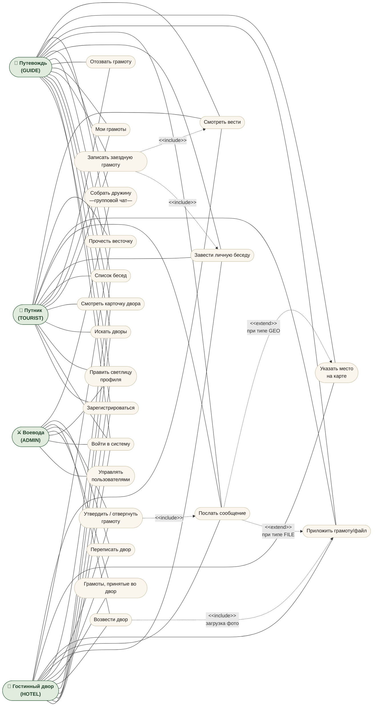

# Use-Case диаграмма

Четыре актора: **Путник (TOURIST)**, **Путевождь (GUIDE)**, **Гостинный двор (HOTEL)**, **Воевода (ADMIN)**.
Mermaid не умеет нативный UML use-case, поэтому диаграмма дана в виде графа: акторы — слева/справа, прецеденты — в середине, `<<include>>` и `<<extend>>` подписаны на рёбрах.

## Роли и ключевые сценарии

| Прецедент | TOURIST | GUIDE | HOTEL | ADMIN | Реализация |
|---|---|---|---|---|---|
| Регистрация / логин | ✅ | ✅ | ✅ | ✅ | `POST /api/auth/register`, `POST /api/auth/login` |
| Поиск дворов | ✅ | ✅ | ✅ | ✅ | `GET /api/hotels` |
| Запись заездной грамоты | ✅ | ✅ | — | ✅ | `POST /api/bookings` (`@PreAuthorize hasAnyRole('TOURIST','GUIDE','ADMIN')`) |
| Отзыв своей грамоты | ✅ | ✅ | — | ✅ | `POST /api/bookings/{id}/status status=CANCELLED` |
| Возвести двор | — | — | ✅ | ✅ | `POST /api/hotels` (`hasAnyRole('HOTEL','ADMIN')`) |
| Утвердить/отвергнуть грамоту | — | — | ✅ (свои) | ✅ | `POST /api/bookings/{id}/status` |
| Личная беседа | ✅ | ✅ | ✅ | ✅ | `POST /api/chats` `type=PERSONAL` |
| Групповой чат | — | ✅ | — | ✅ | `POST /api/chats` `type=GROUP` (`ChatService.createGroup` проверяет роль) |
| Послать гео-метку | — | ✅ | ✅ | ✅ | `POST /api/geo/points` (`hasAnyRole('GUIDE','HOTEL','ADMIN')`) |
| Вести (уведомления) | ✅ | ✅ | ✅ | ✅ | `GET /api/notifications` + WS `/user/queue/notifications` |

## Бизнес-инварианты, проверяемые на сервере

1. У путника не может быть **двух активных грамот** на тот же двор с пересекающимися датами (`BookingRepository.countOverlappingForUser`).
2. Сумма пересекающихся броней по двору не превышает `roomsAvailable`.
3. Изменение `is_active` отеля видно сразу в поиске (фильтр `WHERE h.active = true`).
4. Удалить отель, по которому есть брони, невозможно (`ON DELETE RESTRICT`).
5. Удалить владельца дворов — отель остаётся «бесхозным» (`ON DELETE SET NULL`).
