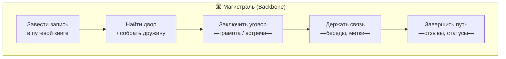

# User Story Map — Бёreza

Story map по Jeff Patton: горизонталь — **магистраль (backbone) пользовательского пути**, вертикаль — **release-срезы** (MVP → нынешний → backlog). Все три актора (путник, путевождь, гостинный двор) идут по своим тропам, но с пересечениями в «беседах» и «вестях».

## Магистраль и активности

## Карта историй

### 🚶 Путник (TOURIST)

| Активность | MVP — уже работает ✅ | Backlog 🌱 |
|---|---|---|
| **Завести запись** | Регистрация с ролью «путник», логин, правка светлицы, аватар по URL. | Логин по соц-сетям, OTP/SMS, восстановление пароля. |
| **Найти двор** | Поиск по граду / мзде / звёздам; карточка двора с фото, описанием, удобствами. | Фильтры по удобствам-чипам, карта дворов, избранное, сортировка. |
| **Заключить уговор** | Записать грамоту: даты, души, светлицы. Запрет на дубликаты дат у того же двора. Автосоздание личной беседы с владельцем + BOOKING-карточка в чате. | Онлайн-оплата, отмена с возвратом, динамические цены. |
| **Держать связь** | Реал-тайм беседа, прикрепление файлов, чтение чужих гео-меток на OSM-карте, индикатор «печатает», прочтения. | Отправка своих фото локации, реакции (👍❤), ответы (reply), редактирование. |
| **Завершить путь** | Сменить статус «Отозвать», увидеть исход (CONFIRMED/COMPLETED), вести-уведомления о смене статуса. | Отзыв на двор/путевождя, рейтинг 1–5, программа лояльности. |

### 🧭 Путевождь (GUIDE)

| Активность | MVP ✅ | Backlog 🌱 |
|---|---|---|
| **Завести запись** | Регистрация как «путевождь», профиль с аватаром. | Верификация лицензии гида, рейтинг. |
| **Найти двор / собрать дружину** | Может сам бронировать дворы; **единственный**, кто может собирать дружину (групповой чат). Поиск участников по имени. | Шаблоны туров, расписание выходов. |
| **Заключить уговор** | Создание тура = групповой чат + персональные брони. | Продажа мест в туре через грамоту. |
| **Держать связь** | Указывать точки сбора, достопримечательности, аварийные точки на карте (роль `MEETING_POINT`/`ATTRACTION`/`EMERGENCY`). | Маршрут-нитка между метками, шаринг GPX, лайв-трекинг путников. |
| **Завершить путь** | Перевод чата в архив, уведомления участникам. | Авто-завершение по дате тура, сбор отзывов с дружины. |

### 🏨 Гостинный двор (HOTEL)

| Активность | MVP ✅ | Backlog 🌱 |
|---|---|---|
| **Завести запись** | Регистрация с ролью «гостинный двор». | Подтверждение собственности дворов (документы). |
| **Возвести двор** | Полная форма создания/редактирования: имя, град, улица, звёзды, мзда, светлицы, удобства (пресет + кастом), мульти-загрузка изображений. Тумблер «отворить врата». | Импорт из Booking/Avito, привязка к карте через ту же OSM-метку. |
| **Заключить уговор** | Принимать брони во вкладке «Грамоты, принятые во двор»; утвердить / отвергнуть; авто-сообщение в личный чат с гостем. | Канбан-доска броней, календарь занятости. |
| **Держать связь** | Отвечать гостям в чате, прикладывать voucher/ticket, указывать на карте точку у двора. | Авто-ответы FAQ, шаблоны ответов. |
| **Завершить путь** | Статус COMPLETED, уведомление гостю. | Отчёт по выручке за период, выгрузка в CSV. |

### ⚔ Воевода (ADMIN)

| Активность | MVP ✅ | Backlog 🌱 |
|---|---|---|
| Управление | Всё, что доступно остальным ролям; @PreAuthorize пропускает ADMIN везде, где есть HOTEL/GUIDE/TOURIST. | Дашборд метрик, бан/разблокировка пользователей (поле `is_locked`), модерация контента, рассылки. |

---

## Release-срезы

```mermaid
flowchart LR
  classDef done fill:#e1ebde,stroke:#2f5d3a
  classDef next fill:#fbf0d3,stroke:#b58a3c
  classDef later fill:#f6f2ea,stroke:#cfc6ad

  subgraph MVP["MVP — выпущено"]
    M1[Аутентификация + 4 роли]:::done
    M2[Каталог + бронирование]:::done
    M3[Реал-тайм беседы со вложениями]:::done
    M4[Управление дворами]:::done
    M5[Гео-метки на карте<br/>—GUIDE/HOTEL—]:::done
    M6[Push-уведомления через WS]:::done
  end
  subgraph NEXT["Следующий релиз"]
    N1[Отзывы и рейтинги]:::next
    N2[Календарь занятости отеля]:::next
    N3[Карта дворов в каталоге]:::next
    N4[Оплата онлайн]:::next
  end
  subgraph LATER["Долгий бэклог"]
    L1[Мобильное приложение]:::later
    L2[Маршруты GPX]:::later
    L3[Программа лояльности]:::later
    L4[Интеграции с OTA]:::later
  end
  MVP --> NEXT --> LATER
```

## Покрытие историй кодом

| История | Где смотреть в коде |
|---|---|
| Регистрация / логин | `AuthController`, `AuthService`, `BerezaUserDetailsService`, `SecurityConfig` |
| Поиск дворов | `HotelController.search`, `HotelRepository.search` |
| Бронь без пересечений | `BookingService.create`, `BookingRepository.countOverlappingForUser` |
| Управление двором | `HotelController` (`/my`, `POST`, `PUT`), `HotelManagePage.jsx`, `HotelEditPage.jsx` |
| Real-time беседа | `ChatWebSocketController`, `ChatEventPublisher`, `ChatRoomPage.jsx`, `ws/stomp.js` |
| Гео-метки + карта | `GeoController`, `GeoService`, `LocationPickerModal.jsx` (Leaflet + OSM) |
| Группы только для GUIDE | `ChatService.createGroup` (проверка `role`), `ChatsPage.jsx` (UI-гард) |
| Уведомления | `NotificationService`, `NotificationContext.jsx`, WS `/user/queue/notifications` |
