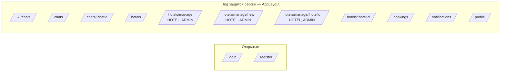

# Веб-приложение — страницы и маршруты

Frontend — React 18 + React Router v6, SPA-сборка через Vite (`/frontend`). Все защищённые маршруты обёрнуты в `<ProtectedRoute>` (редирект на `/login` при отсутствии сессии) и общим `<AppLayout>` (сайдбар + контент).

## Карта маршрутов

## Реестр страниц

| Маршрут | Компонент | Доступ | Что делает | API / WS |
|---|---|---|---|---|
| `/login` | `LoginPage.jsx` | гость | Логин (form-urlencoded) | `GET /api/auth/csrf`, `POST /api/auth/login`, `GET /api/auth/me` |
| `/register` | `RegisterPage.jsx` | гость | Регистрация (4 роли) | `POST /api/auth/register`, `POST /api/auth/login` |
| `/` | redirect | authenticated | → `/chats` | — |
| `/chats` | `ChatsPage.jsx` | authenticated | Список бесед. Модал «Завести беседу» (PERSONAL для всех, GROUP только GUIDE/ADMIN). | `GET /api/chats`, `GET /api/users?q=` (поиск), `POST /api/chats` |
| `/chats/:chatId` | `ChatRoomPage.jsx` | участник | Лента сообщений (REST history + WS-обновления), отправка текста/файлов, индикатор «печатает», отметка прочтения, гео-метки на карте (только GUIDE/HOTEL/ADMIN). | `GET /api/chats/:id`, `GET .../messages`, `POST .../messages`, `POST .../read`, `POST /api/files`, `POST /api/geo/points`; STOMP: `/topic/chats.{id}`, `.typing`, `.reads`, `/app/chats/{id}/typing` |
| `/hotels` | `HotelsPage.jsx` | authenticated | Поиск дворов (город/мзда/звёзды), карточки. | `GET /api/hotels` |
| `/hotels/:hotelId` | `HotelDetailsPage.jsx` | authenticated | Подробности двора + форма брони (даты/души/светлицы). | `GET /api/hotels/:id`, `POST /api/bookings` |
| `/hotels/manage` | `HotelManagePage.jsx` | `HOTEL`, `ADMIN` | Список «моих» дворов. | `GET /api/hotels/my` |
| `/hotels/manage/new` | `HotelEditPage.jsx` | `HOTEL`, `ADMIN` | Создание нового двора (форма + загрузка фото). | `POST /api/files`, `POST /api/hotels` |
| `/hotels/manage/:hotelId` | `HotelEditPage.jsx` | `HOTEL`, `ADMIN` (владелец) | Редактирование двора. | `GET /api/hotels/:id`, `POST /api/files`, `PUT /api/hotels/:id` |
| `/bookings` | `BookingsPage.jsx` | authenticated | Вкладки «Мои грамоты» и (для HOTEL/ADMIN) «Принятые во двор». Кнопки утвердить/отвергнуть/отозвать. | `GET /api/bookings/my`, `GET /api/bookings/incoming`, `POST /api/bookings/:id/status` |
| `/notifications` | `NotificationsPage.jsx` | authenticated | Лента «Вестей», отметка «прочтено». | `GET /api/notifications`, `POST /api/notifications/:id/read`; STOMP: `/user/queue/notifications` |
| `/profile` | `ProfilePage.jsx` | authenticated | Светлица: правка имени, гонца (телефон), лика (avatar URL). | `GET /api/users/me`, `PUT /api/users/me` |

## Глобальные контексты

| Контекст | Файл | Что хранит |
|---|---|---|
| `AuthContext` | `frontend/src/context/AuthContext.jsx` | текущий пользователь, `login()`, `logout()`, `refresh()`. Подтягивает `GET /api/auth/me` при старте. |
| `NotificationContext` | `frontend/src/context/NotificationContext.jsx` | лента вестей, число непрочитанных, подписка на `/user/queue/notifications`. |

## Слой API

| Модуль | Что покрывает |
|---|---|
| `api/client.js` | axios instance, baseURL, cookie-jar, CSRF helpers. |
| `api/auth.js` | `login`, `logout`, `register`, `fetchMe`. |
| `api/users.js` | `me`, `updateMe`, `searchUsers`. |
| `api/hotels.js` | `searchHotels`, `getHotel`, `myHotels`, `createHotel`, `updateHotel`. |
| `api/bookings.js` | `createBooking`, `myBookings`, `incomingBookings`, `changeStatus`. |
| `api/chats.js` | `listChats`, `getChat`, `createChat`, `addMember`, `removeMember`, `listMessages`, `sendMessage`, `markRead`, `deleteMessage`. |
| `api/files.js` | `uploadFile`, `fileUrl`. |
| `api/geo.js` | `createGeoPoint`, `listForChat`. |
| `api/notifications.js` | `listNotifications`, `unreadCount`, `markNotificationRead`. |
| `ws/stomp.js` | `getStompClient`, `awaitConnected`, `onStompStatus`. |

## Компоненты, переиспользуемые между страницами

| Компонент | Где | Назначение |
|---|---|---|
| `AppLayout` | `components/AppLayout.jsx` | Сайдбар, навигация, аватар пользователя. Скрывает «Мой двор» для не-HOTEL. |
| `ProtectedRoute` | `components/ProtectedRoute.jsx` | Гейт по сессии. |
| `MessageList` | `components/MessageList.jsx` | Отрисовка ленты: TEXT, FILE, GEO, BOOKING, SYSTEM. |
| `MessageInput` | `components/MessageInput.jsx` | Composer: текст, прикрепить файл, послать геометку (кнопка видна только если передан `onShareLocation`). |
| `LocationPickerModal` | `components/LocationPickerModal.jsx` | Leaflet + OSM tiles + Nominatim-поиск. |
