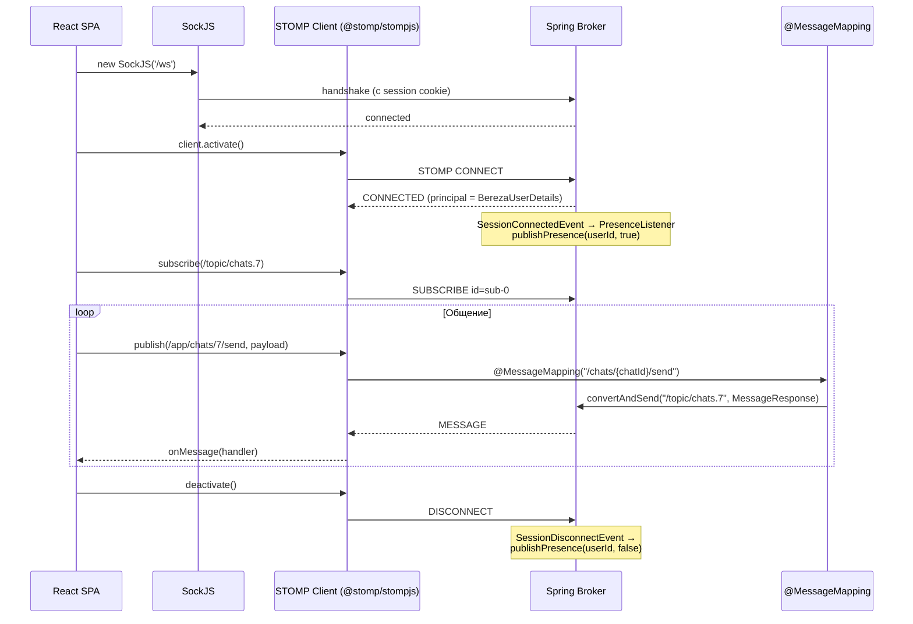

# WebSocket / STOMP

Транспорт — **SockJS** (`/ws`), поверх него **STOMP 1.2**. Аутентификация — через HTTP-сессию (`BEREZA_SESSION`), которая прокидывается в WebSocket. CSRF для `/ws/**` отключён.

```
Browser  ──(SockJS handshake /ws)──▶  Nginx ──▶ Spring Boot
   STOMP CONNECT  (нет креденшлов — берём из session)
   STOMP SUBSCRIBE / SEND / UNSUBSCRIBE
```

Брокер — встроенный `SimpleBroker` (in-memory). Префиксы:

| Префикс | Назначение |
|---|---|
| `/app/**` | Клиент → сервер (попадает в `@MessageMapping`). |
| `/topic/**` | Широковещание сервер → подписчики. |
| `/queue/**` | Сообщения конкретному пользователю. |
| `/user/**` | Persona-routing: `convertAndSendToUser(name, dest, ...)` → клиент слушает `/user/queue/...`. |

---

## Client → Server (`/app/**`)

Реализованы в `ChatWebSocketController`.

### `SEND /app/chats/{chatId}/send`
Эквивалент `POST /api/chats/{chatId}/messages`, но без HTTP-round-trip.

**Body** (`SendMessageRequest`):
```json
{ "type": "TEXT", "content": "Привет", "attachmentIds": [], "replyToId": null }
```
**Эффект**: сохраняет сообщение, публикует в `/topic/chats.{chatId}`.

### `SEND /app/chats/{chatId}/typing`
Сигнал «печатает…».
**Body**: `{}` (опционально).
**Эффект**: транслирует в `/topic/chats.{chatId}.typing` payload `{userId, displayName}`.

### `SEND /app/chats/{chatId}/read`
Отметить сообщение прочитанным.
**Body**: `{ "messageId": 100 }`.
**Эффект**: пишет `MessageRead`, обновляет `chat_members.last_read_message_id`, публикует в `/topic/chats.{chatId}.reads` payload `{messageId, userId}`.

### `SUBSCRIBE /app/chats.{chatId}.history`  *(SubscribeMapping)*
Одноразовый ответ — последние 50 сообщений. Используется для «дозагрузки» на момент подписки (опционально, фронт обычно делает REST `GET /api/chats/{chatId}/messages`).

---

## Server → Client topics (`/topic/**`)

Подписки фронта в `ChatRoomPage`/`NotificationContext`.

| Топик | Когда публикуется | Тело |
|---|---|---|
| `/topic/chats.{chatId}` | новое сообщение в чате (через REST `POST` или STOMP `send`) | `MessageResponse` |
| `/topic/chats.{chatId}.typing` | пришёл `typing`-сигнал от участника | `{ "userId": 2, "displayName": "Иван" }` |
| `/topic/chats.{chatId}.reads` | кто-то прочитал сообщение | `{ "messageId": 100, "userId": 2 }` |
| `/topic/presence` | пользователь подключился/отключился (см. `PresenceListener`) | `{ "userId": 2, "online": true }` |

### Персональная очередь

| Назначение | Когда |
|---|---|
| `/user/queue/notifications` | `NotificationService.push(...)` отправляет JSON-уведомление адресату. Frontend NotificationContext подписывается на эту очередь. |

---

## Жизненный цикл подключения



---

## События Spring (server-side)

| Событие | Listener | Действие |
|---|---|---|
| `SessionConnectedEvent` | `PresenceListener.onConnect` | `publishPresence(userId, true)` в `/topic/presence` |
| `SessionDisconnectEvent` | `PresenceListener.onDisconnect` | `userService.touchLastSeen(userId)` + `publishPresence(userId, false)` |
