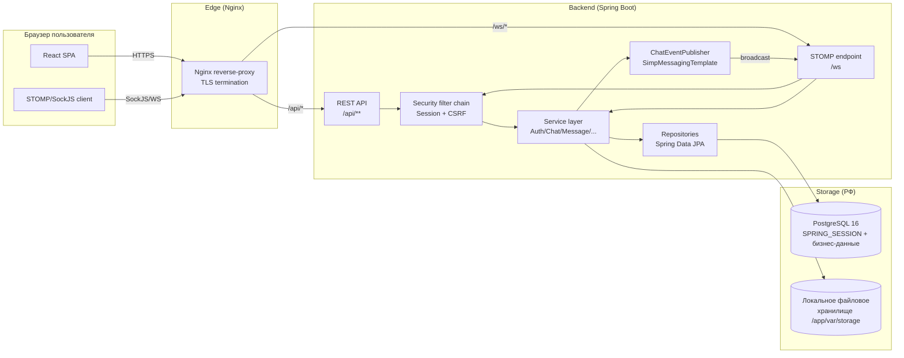

# Архитектура проекта Бёreza

## 1. Высокоуровневая схема



## 2. Слойность (Clean Architecture)

```
web (Controllers, DTO, mappers)
   ↓
service (use-cases, транзакции, доменные правила)
   ↓
repository (Spring Data JPA, Hibernate)
   ↓
domain (JPA-сущности, enums)
```

- **Контроллеры** не содержат бизнес-логики, только маршрутизация и валидация.
- **Сервисы** ведут транзакции (`@Transactional`), вызывают репозитории и
  публикуют доменные события через `ChatEventPublisher` / `NotificationService`.
- **Репозитории** — только агрегаты JPA, никаких HTTP/WS зависимостей.
- **Domain** не зависит ни от Spring, ни от веб-слоя (кроме JPA-аннотаций).

Это даёт два важных следствия:

1. Сервис-слой можно покрыть unit-тестами без поднятия HTTP-контекста.
2. Любой слой (например, веб) может быть заменён (REST → gRPC, мобильный клиент)
   без переписывания доменных правил.

## 3. Безопасность

| Угроза            | Меры защиты                                                                    |
|-------------------|---------------------------------------------------------------------------------|
| Session Hijacking | HttpOnly + Secure (prod) + SameSite=Lax; rotation через `ChangeSessionIdStrategy` |
| Session Fixation  | Меняем session id при логине                                                    |
| CSRF              | Double-submit cookie (`XSRF-TOKEN`) + заголовок `X-XSRF-TOKEN`                  |
| XSS               | React по умолчанию экранирует; CSP/HSTS/Referrer-Policy выставлены через `HeadersConfigurer` |
| SQL Injection     | Только параметризованные запросы (JPA Criteria/JPQL/`@Param`)                   |
| Brute force       | `BCryptPasswordEncoder(strength=12)` + ограничение `maximum-sessions=5`         |
| Загрузка вируса   | `Apache Tika` определяет MIME по содержимому; whitelist allowed-mime            |
| Утечка ПДн        | Хранение строго на серверах РФ (PostgreSQL + локальный диск); HTTPS на edge     |

### Поток аутентификации

```mermaid
sequenceDiagram
  participant U as Пользователь
  participant FE as React SPA
  participant BE as Spring Security
  participant DB as PostgreSQL
  U->>FE: открывает /login
  FE->>BE: GET /api/auth/csrf
  BE-->>FE: Set-Cookie: XSRF-TOKEN=...; JSON{token}
  U->>FE: вводит login/password
  FE->>BE: POST /api/auth/login (form, X-XSRF-TOKEN)
  BE->>DB: SELECT users WHERE username = ?
  DB-->>BE: user(passwordHash)
  BE->>BE: BCrypt.matches(pwd, hash)
  BE->>BE: ChangeSessionId() — rotate
  BE-->>FE: Set-Cookie: BEREZA_SESSION=...; HttpOnly, Secure
  BE-->>FE: 200 OK + AuthResponse JSON
  FE->>FE: AuthContext.setUser(...)
  FE-->>U: переход в /chats
```

## 4. Масштабируемость

- **Stateless backend** в части кода (сессии вынесены в PostgreSQL).
  Поднять можно несколько подов backend за балансировщиком (sticky session не нужен).
- **Spring Session** легко переключается на Redis (`spring-session-data-redis`) одной зависимостью —
  Postgres достаточен для среднего трафика, Redis оправдан > 50k одновременных сессий.
- **WebSocket-кластер.** При масштабировании WS перейти с SimpleBroker на
  RabbitMQ/ActiveMQ STOMP relay (`registry.enableStompBrokerRelay`), чтобы
  пользовательские очереди и `/topic/*` маршрутизировались между узлами.
- **Файлы.** Локальный диск → объектное хранилище (`yandex object storage`,
  `selectel s3`) через `S3Client` — заменяется только `FileStorageService`.
- **PostgreSQL.** Тяжёлые запросы (history per chat) уже идут по индексу
  `ix_messages_chat_created`. На больших объёмах — секционирование `messages` по `chat_id`
  или `created_at`.

## 5. Производительность

- Hikari connection pool 5–20.
- `spring.jpa.open-in-view: false` — никакого N+1 в рендере; всё через DTO/projections.
- `hibernate.jdbc.batch_size: 30` для пакетных операций (массовые `markRead`).
- Пагинация: history через `Slice` (без `count(*)`), списки — `Page`.

## 6. Надёжность

- `@RestControllerAdvice GlobalExceptionHandler` отдаёт RFC 7807 `ProblemDetail`.
- `spring-boot-starter-actuator` экспонирует `/actuator/health/liveness|readiness`
  и `/actuator/info`. Liveness используется в docker `HEALTHCHECK`.
- Логирование — `slf4j + logback`, в проде — INFO root / WARN security.
- Graceful shutdown задействован Spring Boot из коробки (`server.shutdown=graceful`).
