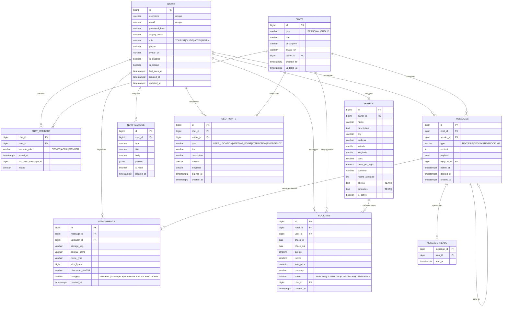

# База данных

PostgreSQL 16. Все таблицы используют `BIGINT GENERATED ALWAYS AS IDENTITY`,
временные метки — `TIMESTAMPTZ`. Кодировка БД — `UTF8`, локаль `ru_RU.UTF-8`.

## ER-диаграмма

## Индексы (важные)

| Индекс                                | Назначение                                                |
|---------------------------------------|-----------------------------------------------------------|
| `ux_users_username_lower`             | Уникальность логина без учёта регистра                    |
| `ux_users_email_lower`                | Уникальность email без учёта регистра                     |
| `ix_messages_chat_created (DESC)`     | Быстрая выгрузка истории чата (`Slice<Message>` history)   |
| `ix_notifications_user_unread`        | Композитный: счётчик непрочитанных, hot-path               |
| `ix_bookings_status, ix_bookings_check_in` | Поиск пересекающихся броней (overlap query)           |
| `ix_chat_members_user`                | "Все чаты пользователя"                                   |
| `ix_hotels_city`, `ix_hotels_price`   | Фильтрация в поиске отелей                                |

## Целостность и инварианты

- `users.role` — `CHECK IN (...)`, аналогично у `chats.type`, `messages.type`,
  `chat_members.member_role`, `attachments.category`, `bookings.status`,
  `geo_points.type`. Защищает от мусора, даже если приложение ошибётся.
- `bookings.check_out > check_in` — `CHECK`.
- FK с `ON DELETE` стратегией: `SET NULL` для авторов сообщений
  (сообщение остаётся после удаления юзера), `CASCADE` для `chat_members` и
  `attachments` к удалению сообщения.

## Миграции

| Версия | Файл                             | Содержимое                                |
|--------|----------------------------------|-------------------------------------------|
| V1     | `V1__init_schema.sql`            | Бизнес-схема                              |
| V2     | `V2__spring_session.sql`         | Таблицы `SPRING_SESSION` + индексы        |
| V3     | `V3__seed_demo_data.sql`         | Демо-пользователи и три отеля             |

Для прод-деплоя можно отключить демо-данные параметром `spring.flyway.target=2`.
