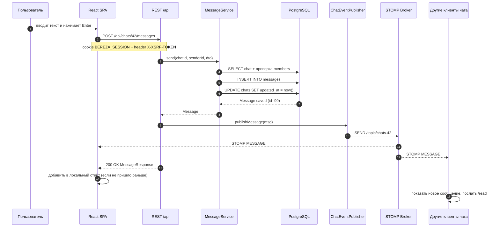
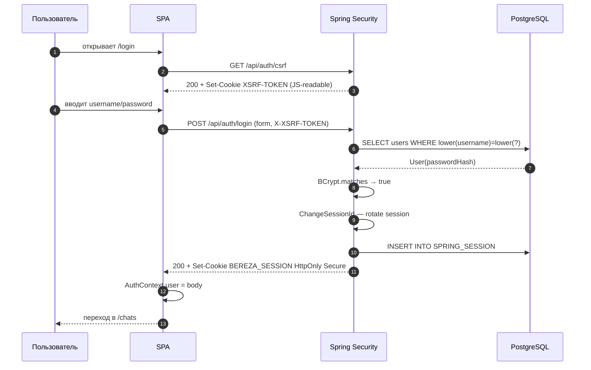
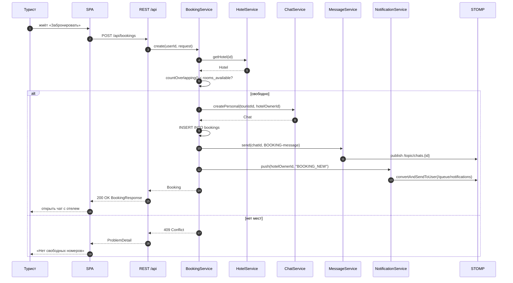
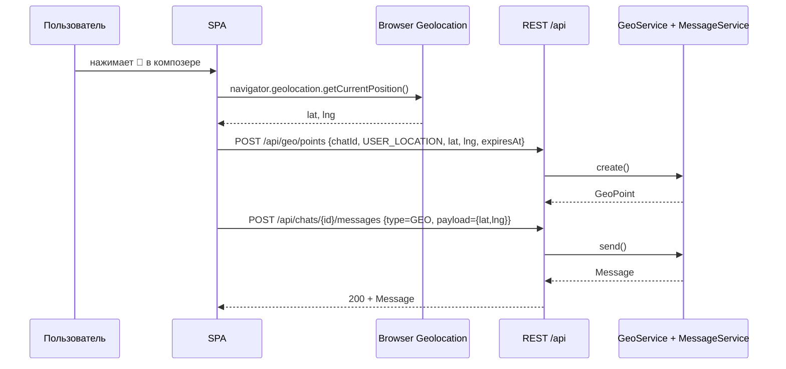

# Sequence-диаграммы

## 1. Отправка сообщения

```mermaid
sequenceDiagram
  autonumber
  participant U as Пользователь
  participant FE as React SPA
  participant API as REST /api
  participant SVC as MessageService
  participant DB as PostgreSQL
  participant PUB as ChatEventPublisher
  participant BROKER as STOMP Broker
  participant FE2 as Другие клиенты чата

  U->>FE: вводит текст и нажимает Enter
  FE->>API: POST /api/chats/42/messages
  Note over FE,API: cookie BEREZA_SESSION + header X-XSRF-TOKEN
  API->>SVC: send(chatId, senderId, dto)
  SVC->>DB: SELECT chat + проверка members
  SVC->>DB: INSERT INTO messages
  SVC->>DB: UPDATE chats SET updated_at = now()
  DB-->>SVC: Message saved (id=99)
  SVC-->>API: Message
  API->>PUB: publishMessage(msg)
  PUB->>BROKER: SEND /topic/chats.42
  BROKER-->>FE: STOMP MESSAGE
  BROKER-->>FE2: STOMP MESSAGE
  API-->>FE: 200 OK MessageResponse
  FE->>FE: добавить в локальный стейт (если не пришло раньше)
  FE2->>FE2: показать новое сообщение, послать /read
```

## 2. Логин

```mermaid
sequenceDiagram
  autonumber
  participant U as Пользователь
  participant FE as SPA
  participant SEC as Spring Security
  participant DB as PostgreSQL
  U->>FE: открывает /login
  FE->>SEC: GET /api/auth/csrf
  SEC-->>FE: 200 + Set-Cookie XSRF-TOKEN (JS-readable)
  U->>FE: вводит username/password
  FE->>SEC: POST /api/auth/login (form, X-XSRF-TOKEN)
  SEC->>DB: SELECT users WHERE lower(username)=lower(?)
  DB-->>SEC: User(passwordHash)
  SEC->>SEC: BCrypt.matches → true
  SEC->>SEC: ChangeSessionId — rotate session
  SEC->>DB: INSERT INTO SPRING_SESSION
  SEC-->>FE: 200 + Set-Cookie BEREZA_SESSION HttpOnly Secure
  FE->>FE: AuthContext.user = body
  FE-->>U: переход в /chats
```

## 3. Бронирование отеля

```mermaid
sequenceDiagram
  autonumber
  participant T as Турист
  participant FE as SPA
  participant API as REST /api
  participant BS as BookingService
  participant HS as HotelService
  participant CS as ChatService
  participant MS as MessageService
  participant NS as NotificationService
  participant WS as STOMP

  T->>FE: жмёт «Забронировать»
  FE->>API: POST /api/bookings
  API->>BS: create(userId, request)
  BS->>HS: getHotel(id)
  HS-->>BS: Hotel
  BS->>BS: countOverlapping() < rooms_available?
  alt свободно
    BS->>CS: createPersonal(touristId, hotelOwnerId)
    CS-->>BS: Chat
    BS->>BS: INSERT INTO bookings
    BS->>MS: send(chatId, BOOKING-message)
    MS->>WS: publish /topic/chats.{id}
    BS->>NS: push(hotelOwnerId, "BOOKING_NEW")
    NS->>WS: convertAndSendToUser(/queue/notifications)
    BS-->>API: Booking
    API-->>FE: 200 OK BookingResponse
    FE-->>T: открыть чат с отелем
  else нет мест
    BS-->>API: 409 Conflict
    API-->>FE: ProblemDetail
    FE-->>T: «Нет свободных номеров»
  end
```

## 4. Геолокация: «поделиться позицией»

```mermaid
sequenceDiagram
  participant U as Пользователь
  participant FE as SPA
  participant GEO as Browser Geolocation
  participant API as REST /api
  participant SVC as GeoService + MessageService
  U->>FE: нажимает 📍 в композере
  FE->>GEO: navigator.geolocation.getCurrentPosition()
  GEO-->>FE: lat, lng
  FE->>API: POST /api/geo/points {chatId, USER_LOCATION, lat, lng, expiresAt}
  API->>SVC: create()
  SVC-->>API: GeoPoint
  FE->>API: POST /api/chats/{id}/messages {type=GEO, payload={lat,lng}}
  API->>SVC: send()
  SVC-->>API: Message
  API-->>FE: 200 + Message
```
